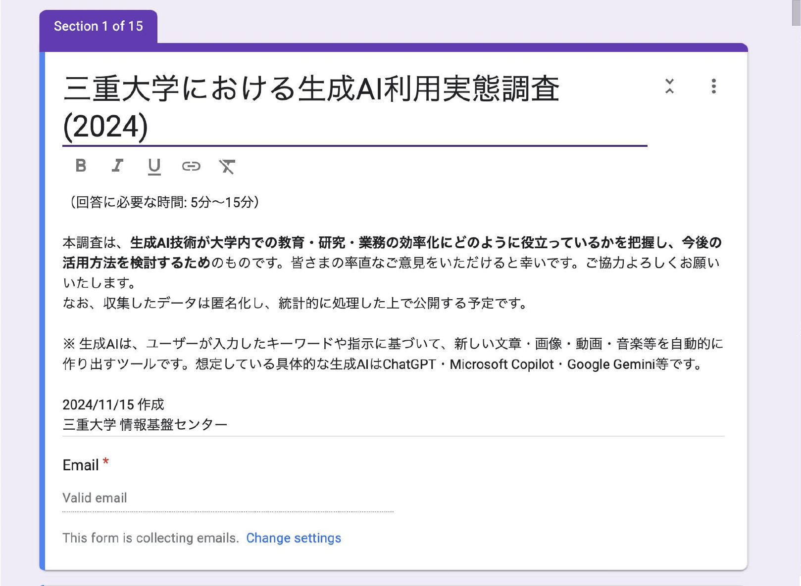

# MieU_GenAI_survey_2024

## 概要

『三重大学における生成AI利用実態調査 (2024)』に関連するファイルを公開するリポジトリです。本リポジトリでは、Googleフォームで作成された調査フォームの内容を記録・共有するためのファイルを提供しています。

Googleフォームには直接的な出力機能がないため、以下の形式で内容を公開しています。

## ファイル構成

- **`Mie_GenAI_survey_form_2024.pdf`**  
  - 
  - Googleフォームのスクリーンキャプチャ画像をPDF形式に変換したものです。一部の設問テキストが途中で切れている箇所があります。
  
- **`Mie_GenAI_survey_form_2024.txt`**  
  - Googleフォームの内容をすべてコピー＆ペーストしてテキストファイル化したものです。こちらは設問の内容が完全に含まれていますが、フォームのレイアウトやグラフィカルな要素は失われています。

## 注意事項

- 公開されているPDFファイルは視覚的な確認用として利用できますが、正確な設問内容の確認にはテキストファイル (`.txt`) をご参照ください。

## 解説動画

調査の詳細については以下の解説動画をご覧ください。  
  
[『三重大学における生成AI利用実態調査 (2024)』解説動画を見る](https://youtu.be/WspQiSgmB8M)
